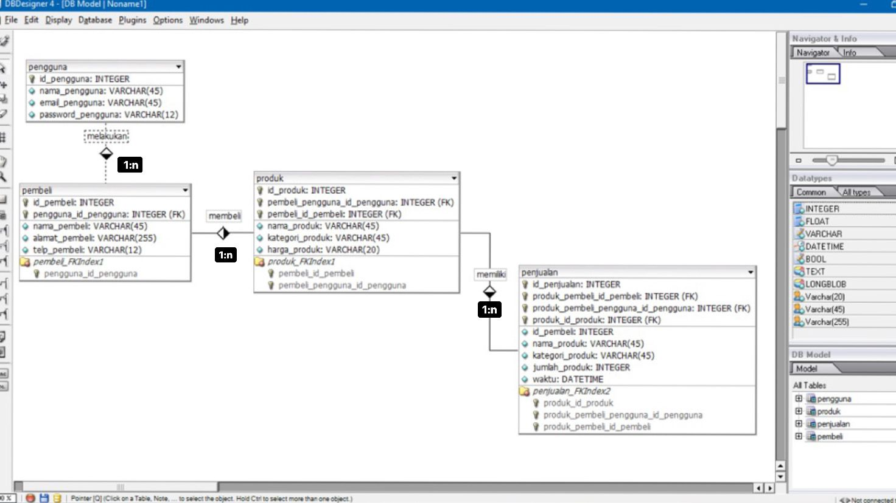

# Technical-Project-Assignment-4

Database application dengan tema Online Retail

Studi Kasus : ERD Tentang Penjualan Produk Online

Penjualan merupakan aktifitas menjual produk. Aktifitas ini di lakukan oleh dua pihak yakni penjual dan pembeli. Pada studi kasus kali ini saya akan membuat perancangan basis data menggunakan pemodelan ERD dengan aturan-aturan berikut:

- Seorang pengguna dapat melakukan beberapa transaksi pembelian
- Seorang pembeli dapat membeli beberapa produk
- Satu produk memiliki beberapa record penjualan

Langkah-langkah Membuat ERD
- Menentukan entitas
- Menentukan atribut termasuk atribut kunci
- Identifikasi relasi
- Menentukan kardinalitas

Berdasarkan aturan-aturan yang di definisikan di atas dapat kita tentukan jumlah entitas ada sebanyak 4 yakni:
1. Pengguna
2. Pembeli
3. Produk
4. Penjualan

### Menentukan Entitas & Atribut
Selanjutnya dari kempat entitas tersebut kita jabarkan atribut-atribut yang melekat pada masing-masing entitas. Atribut yang bersifat unik akan di jadikan sebagai atribut kunci (primary key).

1. Pengguna

    - id_pengguna : integer (PK)
    - nama_pengguna : varchar(45)
    - email_pengguna : varchar(45)
    - password_pengguna : varchar(12)

2. Pembeli

    - id_pembeli : integer (PK)
    - nama_pembeli : varchar(45)
    - alamat : varchar(255)
    - telp_pembeli : varchar(12)

3. Produk

    - id_produk : integer (PK)
    - nama_produk : varchar(45)
    - kategori_produk : varchar(45)
    - harga_produk : varchar(20)

4. Penjualan

    - id_penjualan : integer (PK)
    - id_pembeli : integer
    - nama_produk : varchar(45)
    - kategori_produk : varchar(45)
    - jumlah_produk : integer
    - waktu : datetime

Atribut dengan kode (PK) akan menjadi atribut kunci (primary key) pada masing-masing entitas.

### Menentukan Relasi & Kardinalitasnya

1. Melakukan

    Merupakan relasi antara entitas pengguna dan pembeli yang berarti setiap pengguna boleh melakukan transaksi beberapakali untuk pembelian barang apapun yang ingin dibeli.

    Kardinalitas relasi antara pengguna dan pembeli adalah one to many karena seorang pengguna dapat melakukan banyak banyak transaksi pembelian produk.

2. Membeli

    Merupakan relasi antara entitas pembeli dan produk yang berarti pembeli dapat melakukan pembelian produk yang dijual.

    Kardinalitas relasi antara pembeli dan barang adalah one to many karena seorang pembeli dapat membeli banyak barang atau dengan kata lain banyak barang boleh di beli oleh seorang pembeli.

3. Memiliki

    Merupakan relasi antara entitas produk dan penjualan yang berarti setiap produk mempunyai recod penjualan.

    Kardinalitas relasi antara produk dan penjualan adalah one to many karena satu produk memiliki beberapa record penjualan.

Hasil ERD Penjualan Barang Online
Dari tahap-tahap di atas maka dapat di buat rancangan ERD penjualan barang online adalah sebagai berikut:

### Langkah-langkah Membuat database

- Buka Xampp, nyalakan module apache dan MySQL
- Buka VScode, install extensions Mysql dan diconnectionkan dengan database
- Kemudian, Buatlah file .sql yang berisikan syntax untuk membuat database dan tabel yang dibuat.

    File .sql yang dibuat minimal harus berisi syntax untuk:

    - Membuat database
    - Membuat tabel (semua table harus dibuat)
    - Mengisi data ke tabel (minimal 10 data per tabel)
    - Mengambil data dari tabel
    - Mengubah data di tabel
    - Menghapus data di tabel
    - Menghapus tabel
    - Menghapus database